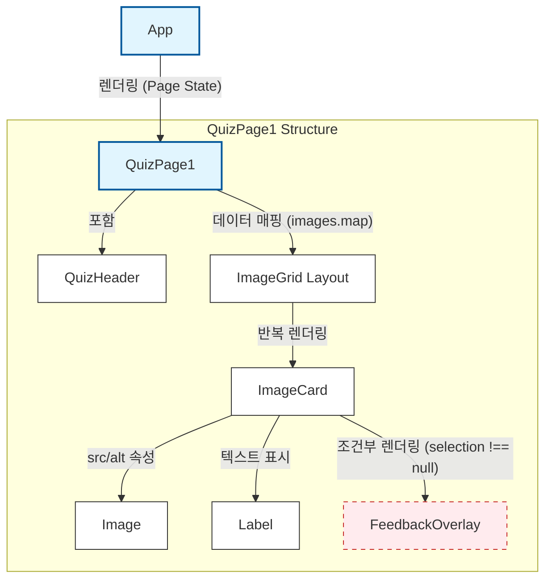
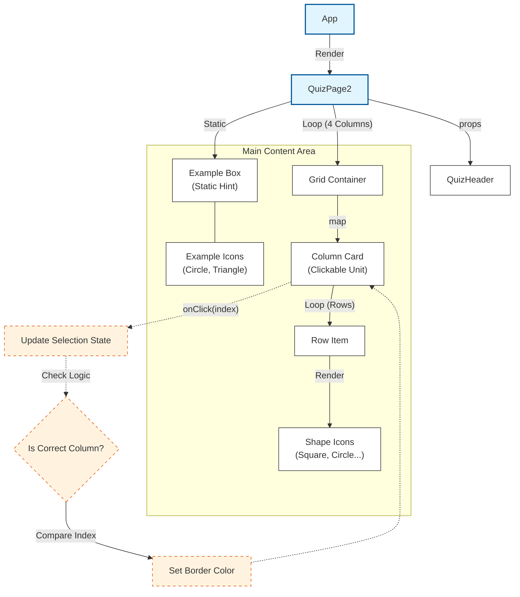
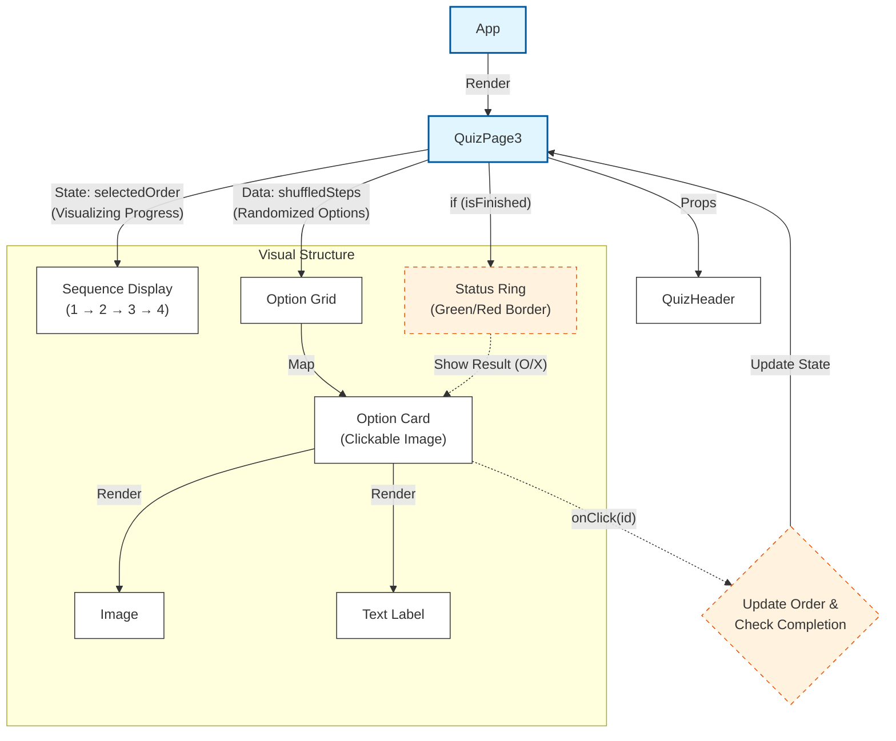

# Quiz1

```mermaid
graph TD
    %% 노드 정의
    App[App]
    QuizPage1[QuizPage1]
    QuizHeader[QuizHeader]
    ImageGrid[ImageGrid Layout]
    ImageCard[ImageCard]
    Img[Image]
    Label[Label]
    FeedbackOverlay[FeedbackOverlay]

    %% 관계 연결 (Flow)
    App -- 렌더링 (Page State) --> QuizPage1
    
    subgraph QuizPage1 Structure
        QuizPage1 -- 포함 --> QuizHeader
        QuizPage1 -- 데이터 매핑 (images.map) --> ImageGrid
        
        ImageGrid -- 반복 렌더링 --> ImageCard
        
        ImageCard -- src/alt 속성 --> Img
        ImageCard -- 텍스트 표시 --> Label
        ImageCard -- 조건부 렌더링 (selection !== null) --> FeedbackOverlay
    end

    %% 스타일 정의
    classDef container fill:#e1f5fe,stroke:#01579b,stroke-width:2px;
    classDef component fill:#fff,stroke:#333,stroke-width:1px;
    classDef conditional fill:#ffebee,stroke:#c62828,stroke-dasharray: 5 5;

    class App,QuizPage1 container;
    class QuizHeader,ImageGrid,ImageCard,Img,Label component;
    class FeedbackOverlay conditional;
```
# Quiz2

```mermaid
graph TD
    %% 노드 정의
    App[App]
    QuizPage2[QuizPage2]
    QuizHeader[QuizHeader]
    
    subgraph ContentArea [Main Content Area]
        ExampleBlock["Example Box<br/>(Static Hint)"]
        ExampleIcons["Example Icons<br/>(Circle, Triangle)"]
        
        GridContainer[Grid Container]
        ColumnCard["Column Card<br/>(Clickable Unit)"]
        RowItem[Row Item]
        ShapeIcon["Shape Icons<br/>(Square, Circle...)"]
    end

    %% 관계 연결 (Flow)
    App -- Render --> QuizPage2
    
    QuizPage2 -- props --> QuizHeader
    QuizPage2 -- Static --> ExampleBlock
    ExampleBlock --- ExampleIcons
    
    QuizPage2 -- "Loop (4 Columns)" --> GridContainer
    GridContainer -- map --> ColumnCard
    
    ColumnCard -- "Loop (Rows)" --> RowItem
    RowItem -- Render --> ShapeIcon
    
    %% 인터랙션 및 로직
    ColumnCard -.-> |"onClick(index)"| UpdateState[Update Selection State]
    UpdateState -.-> |Check Logic| Logic{"Is Correct Column?"}
    Logic -- Compare Index --> Result[Set Border Color]
    Result -.-> ColumnCard

    %% 스타일 정의
    classDef container fill:#e1f5fe,stroke:#01579b,stroke-width:2px;
    classDef component fill:#fff,stroke:#333,stroke-width:1px;
    classDef logic fill:#fff3e0,stroke:#e65100,stroke-dasharray: 5 5;

    class App,QuizPage2 container;
    class QuizHeader,ExampleBlock,GridContainer,ColumnCard,RowItem,ShapeIcon,ExampleIcons component;
    class UpdateState,Logic,Result logic;
```
# Quiz3

```mermaid
graph TD
    %% 노드 정의
    App[App]
    QuizPage3[QuizPage3]
    QuizHeader[QuizHeader]

    subgraph VisualStructure [Visual Structure]
        SequenceDisplay["Sequence Display<br/>(1 → 2 → 3 → 4)"]
        OptionGrid[Option Grid]
        OptionCard["Option Card<br/>(Clickable Image)"]
        
        Img[Image]
        Label[Text Label]
        StatusRing["Status Ring<br/>(Green/Red Border)"]
    end

    %% 관계 연결 (Flow)
    App -- Render --> QuizPage3
    QuizPage3 -- Props --> QuizHeader
    
    %% State 연결
    QuizPage3 -- "State: selectedOrder<br/>(Visualizing Progress)" --> SequenceDisplay
    QuizPage3 -- "Data: shuffledSteps<br/>(Randomized Options)" --> OptionGrid
    
    OptionGrid -- Map --> OptionCard
    OptionCard -- Render --> Img
    OptionCard -- Render --> Label
    
    %% 인터랙션 및 로직
    OptionCard -.-> |"onClick(id)"| Logic{"Update Order &<br/>Check Completion"}
    Logic -- "Update State" --> QuizPage3
    
    %% 피드백 루프 (정답 확인)
    QuizPage3 -- "if (isFinished)" --> StatusRing
    StatusRing -.-> |"Show Result (O/X)"| OptionCard
    
    %% 스타일 정의
    classDef container fill:#e1f5fe,stroke:#01579b,stroke-width:2px;
    classDef component fill:#fff,stroke:#333,stroke-width:1px;
    classDef logic fill:#fff3e0,stroke:#e65100,stroke-dasharray: 5 5;
    
    class App,QuizPage3 container;
    class QuizHeader,SequenceDisplay,OptionGrid,OptionCard,Img,Label component;
    class Logic,StatusRing logic;
```
