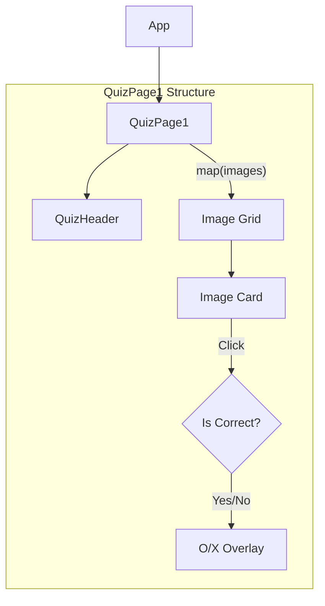
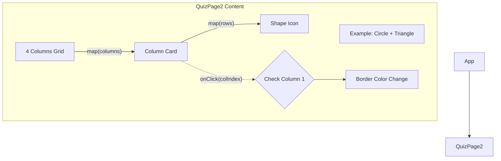
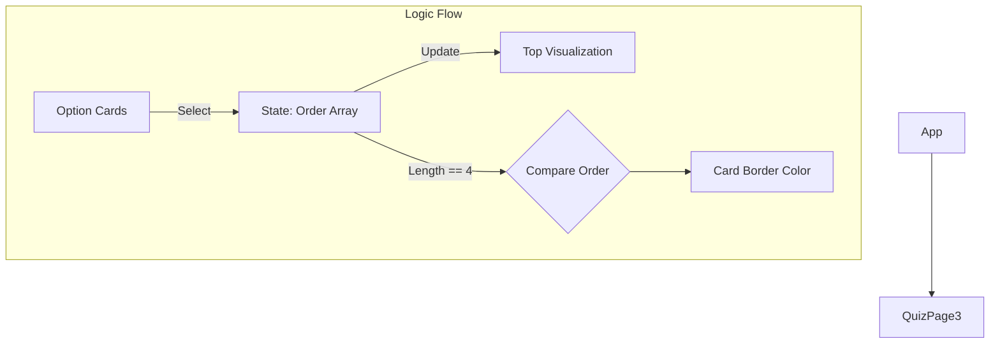

#🧠 두뇌 건강 퀴즈 (Dementia Prevention Quiz)
어르신들의 치매 예방과 인지 능력 향상을 위해 개발된 인터랙티브 웹 애플리케이션입니다. 시각적 지각, 판단력, 순서 배열, 기억력 등 다양한 영역을 게임처럼 훈련할 수 있습니다.

# 주요 기능 (Key Features)
총 4가지의 체계적인 두뇌 훈련 프로그램을 제공합니다.

지각력 훈련 (장소 찾기)

제시된 상황에 맞는 장소 사진을 찾는 시각적 인지 훈련입니다.

판단력 훈련 (도형 규칙 찾기)

예시와 동일한 도형 패턴(모양 및 순서)을 찾는 집중력 훈련입니다.

순서 배열 훈련 (일상 과정 나열)

머리 감기 등 일상생활의 순서를 올바르게 나열하는 논리적 사고 훈련입니다.

기억력 훈련 (단기 기억 테스트)

잠깐 보여주는 도형을 기억했다가 맞추는 단기 기억 강화 훈련입니다.

진행 상황 및 결과 분석

메인 화면에서 훈련 완료 여부를 시각적으로 확인할 수 있습니다.

모든 훈련을 마치면 종합 점수에 따른 맞춤형 피드백을 제공합니다.

# 기술 스택 (Tech Stack)
Frontend Framework: React 19

Language: TypeScript

Build Tool: Vite

Styling: Tailwind CSS (via CDN)

# 시스템 아키텍처 및 데이터 흐름
1. 지각력 훈련 (Quiz 1) 구조
이미지 리스트를 렌더링하고 사용자의 선택에 따라 정답(O/X) 피드백을 즉시 제공합니다.

2. 판단력 훈련 (Quiz 2) 구조
개별 아이콘이 아닌 '세로 열(Column)' 전체를 하나의 선택 단위로 처리하는 것이 특징입니다.

3. 순서 배열 훈련 (Quiz 3) 구조
사용자가 선택한 순서대로 상단에 시각화하며, 4개를 모두 선택했을 때 정답을 검증합니다.

# 설치 및 실행 방법 (Getting Started)
프로젝트 클론

Bash

git clone [repository-url]
cd Cross-platform
패키지 설치

Bash

npm install
개발 서버 실행

Bash

npm run dev
# 폴더 구조 (Project Structure)
src/
├── components/        # UI 컴포넌트
│   ├── StartPage.tsx  # 메인 메뉴 (진행 상황 표시)
│   ├── QuizHeader.tsx # 공통 헤더
│   ├── QuizPage1.tsx  # 지각력 훈련
│   ├── QuizPage2.tsx  # 판단력 훈련
│   ├── QuizPage3.tsx  # 순서 배열 훈련
│   ├── MemoryPage.tsx # 기억력 훈련
│   ├── ResultPage.tsx # 결과 피드백
│   └── icons.tsx      # SVG 아이콘 모음
├── types.ts           # 공통 타입 정의
├── App.tsx            # 라우팅 및 상태 관리
└── index.tsx          # 앱 진입점
